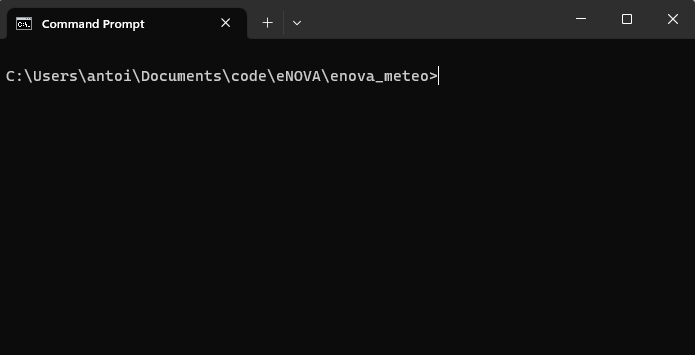
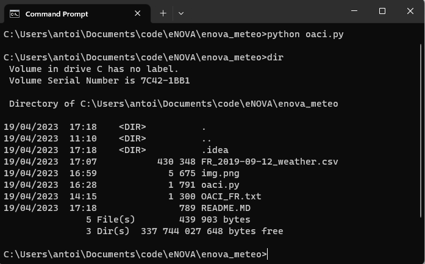
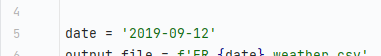
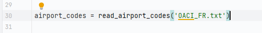
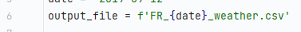

# Weather wrapper

----
The following program **oaci.py** is a program that takes in parameter a **OACI_[country].txt** file where the [country] define the code of a country, for exemple, France will be France, United States of America would be USA, and so on.

------------------

# How to use the program

To launch the program, launch a terminal (shell) on your pc, Windows, Mac, or Linux.

Once you have opened your command prompt, go to the location of the file using the command:

> **cd the/path/** for Linux and Mac,
> 
> **cd \the\path\\** for Windows.

Once you are in the right directory, you can execute the following command:

> **python oaci.py**

Once the comande is complete, it will show you a file named **[country]_[date]_weather.csv rght beside the python script:

You will be able to open the csv file with Microsoft Excel or any other editor that accept the csv format.

-------
# How to edit the program

Now to edit the program, so it can take any date or any country you want, you will have to open in your favorite editor (for exemple PyCharm or Notepad) the file oaci.py.

Once you opened it, you will see the the line 5 the **date** variable. The date is in the following format : YYYY-MM-DD

If you want to have a specific date, you will have to modify this paramter to another year, month and date in the correct format.
> if the format is incorrect, it will not launch and won't operate correctly!

As for the country, if you want to edit it, you can see in the line 30 this:

To change the country you want to retrieve data from, you will have to put a file name **[country]_OACI.txt** instead of **OACI_FR.txt** This fiel contain all OACI codes from the airports of one country.
You'll have to edit on the line 6 as well something.

As you can see, the file starts with the mention **FR**, you'll have to use the right country code.

Once all those modifications are done, you can have all the daily meteorologic datas of one said country!