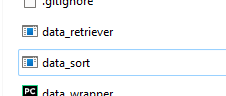
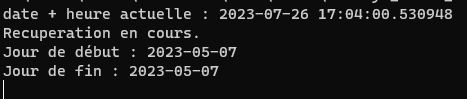
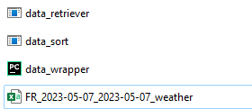
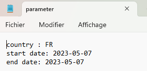
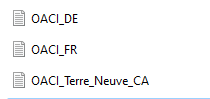
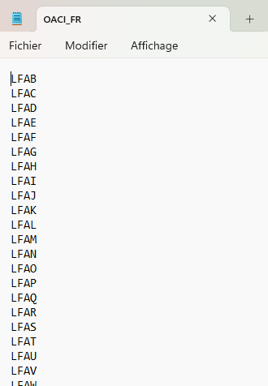
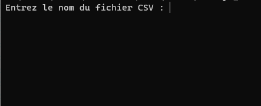
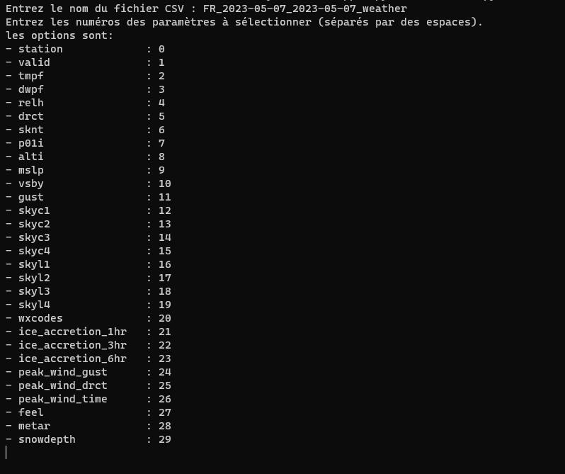
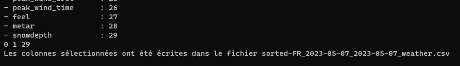

# Meteo Wrapper

> Project realized by Antoine Rovini, student at Epitech Technology, Promo 2025.

-------

### /!\ respect the instructions to not break anything
### /!\ eNOVA use only

----------

The following program advenced_wrapper.py is a program that takes in parameter a OACI_[country].txt file where to
[country] define the code of a country, for exemple, France will be France, United States of America would be USA, and
so on.

-----------

## How to : data_retriever.exe

You will see a program named "data_retriever.exe" in your file explorer. Keep in mind to not move any file to prevent
its non functionnality.

We will double-click on the file and see what it does.

it will say the start and end date of the retrieval of the data. You will have to keep the windows open to let it
retrieve data, otherwise it will shut down the program as well. Once the program finishes it task, it will automatically
close itself, and you will have a file named like this : "FR_2023-05-07_2023-05-07_weather.csv"

If you want to change the start, end date or the country of the data retrieving process, you have to open the
"parameter.txt" file. it will present itself as is :

to edit the dates, keep the same format, being : YYYY-MM-DD (Year Month Day), otherwise you will have wrong dates, or it
won't work. For the country, you can see there are file with country code and the 'OACI_' prefix.

In the 'parameter.txt' file, you will write the name of the file without the prefix or the extension file, the program
will handle itself it. So for exemple, Country Code 'FR' in the parameter file mean the program will read the file named
'OACI_FR.txt' file.

To keep the program functionning, keep the same format for a new file you will create, being the following : 

-------------------

## How To : data_sort.exe

To launch the program, you will have to double-click on the file named "data_sort.exe". It will open a window :

When it asks the namefile, enter the file you want to filter. In this case, it will be
'FR_2023-05-07_2023-05-07_weather'. No need to put the extension of the file.

Once you entered the file, it will ask you the data you want to filter and therefore, keep. If for example, you want to
keep the station row, you will type '0', followed by a space if you want other datas. We will type in 0, 1, and 29.

Once it's done, it will notify it is done effectively, and will automatically close itself.